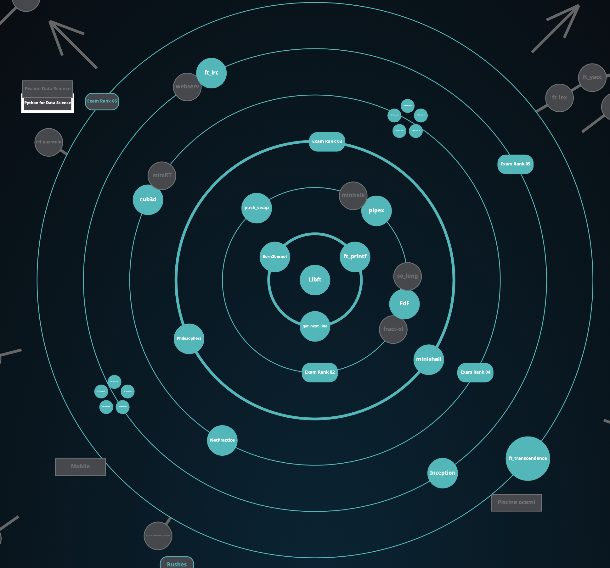

# 42_cursus
### Overview of all my projects at [42 Heilbronn](https://www.42heilbronn.de/en/).

> [!NOTE]
> In October 2024 I achieved ✨ ***MASTERMIND* status** ✨ for completing over *21* projects with the maximum possible score. 🎉 \
> This almost always included difficult extra tasks as a bonus. \
> => My official name on the 42 Intranet has now changed from *fschuber* to ***Mastermind** fschuber*. 💪\
> 

> [!TIP]
> All of the projects that have a repository available (almost all of them) have a light blue border around their icon. \
> They can also all be found in the 📁 projects/ folder.

*The projects are sorted in the order I started them in.*  
- *✅ = done*  
- *💫 = best grade possible*

|Ring|Project                                                                                                             | Description                                                                                       | Finished | Core Grade | Bonus Grade |
|-|--------------------------------------------------------------------------------------------------------------------|---------------------------------------------------------------------------------------------------|----------|-----| ---- |
|0|                       | Coding of own library with recreations of many common C functions for use in future projects.     | 16.10.23 | 100 / 100 ✅| 25 /  25 💫|
|1|             | Recoding of printf to teach about variadic functions and data type conversion.                    | 17.10.23 | 100 / 100 ✅| / |
|1| | Function that returns a text line by line from a file descriptor to teach about static variables. | 19.10.23 | 100 / 100 ✅| / |
|1|                                                            | Introduction to system admin using Debian & VirtualBox.                                           | 26.10.23 | 100 / 100 ✅| / |
|2|👩🏻‍💻 Exam Rank 02                                                                                                                                                                                | First exam. No internet, no ide features, no chatbots, just man.                                               | 06.11.23 | 100 / 100 ✅| unavailable |
|2|                               | Visualisation of a heightmap in a 3d wireframe model, with 3d rotations & multiple projections    | 14.11.23 | 100 / 100 ✅| 25 / 25 💫|
|2|             | Sort data on a stack with the right algorithm for the dataset and with limited moves.             | 08.12.2023| 100 / 100 ✅| 25 / 25 💫|
|2|                                                             | A dive into the mechanics of UNIX pipes and redirections by mimicing the shell's pipe operator.   | 01.12.23 | 100 / 100 ✅| 25 /  25💫|
|3|                                          | Explore multithreading and process synchronization, inspired by Dijkstra's classic Dining Philosophers problem. Fight the deadlocks! | 15.05.2024 | 100 / 100 ✅ | / |
|3|👩🏻‍💻 Exam Rank 03                                                                                                                                                                                | Second exam. No internet, no ide features, no chatbots, just man. I had to code get_next_line.                 | 11.01.24 | 100 / 100 ✅| unavailable |
|3|                                                   | Making of a custom shell with logical and, logical or, brackets for priorities, ’, ", <, >, <<, >>, pipes, $, $?, a history, echo, cd, pwd, export, unset, env, exit, correct executable execution, and a bunch more.| 27.04.24 | 100 / 100 ✅ | 25 /  25 💫 |
|4|             | Exploring Raycasting by making a game inspired by the world-famous Wolfenstein 3d!| 08.07.2024 | 100 / 100 ✅ | 25 /  25 💫 |
|4|👩🏻‍💻 Exam Rank 04                                                                                                                                                                                | Third exam. No internet, no ide features, no chatbots, just man. I had to code "microshell", mini version of minishell.                 | 16.05.2024 | 100 / 100 ✅ | unavailable |
|4|             | Tasks 00 -> 04. Collection of C++ exercises. | 28.08.2024 | 100 / 100 ✅ | 100 % 💫 |
|4|             | Networking & Subnetting exercises. | 03.09.2024 | 100 / 100 ✅ | unavailable |
|5|             | Tasks 05 -> 09. Collection of C++ exercises. | 14.09.2024 | 100 / 100 ✅ | 100 % 💫 |
|5|             | System admin using Docker. (Setting up WordPress) | 🔠| 🔠| 🔠|
|5|👩🏻‍💻 Exam Rank 05                               | Third exam. No internet, no ide features, no chatbots, just man. I had to code a bunch of cpp exercises. Main difficulty was the amount of exercises not the individual difficulty, the three hour time constrait was a huge factor.                 | 04.10.2024 | 100 / 100 ✅ | unavailable |
|5|             | Full implementation of our own IRC server. | 17.01.2024 | 100 / 100 ✅ | 25 / 25 💫 |

---

### The current (07/09/25) overview graph of my 42 progress.

